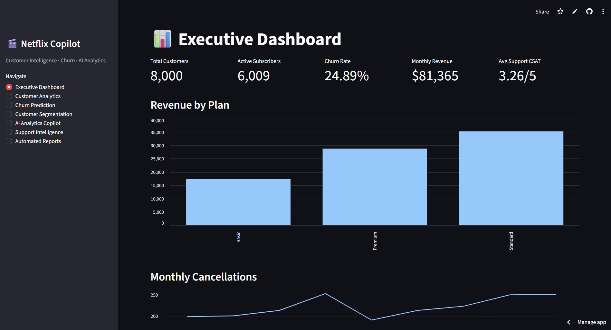
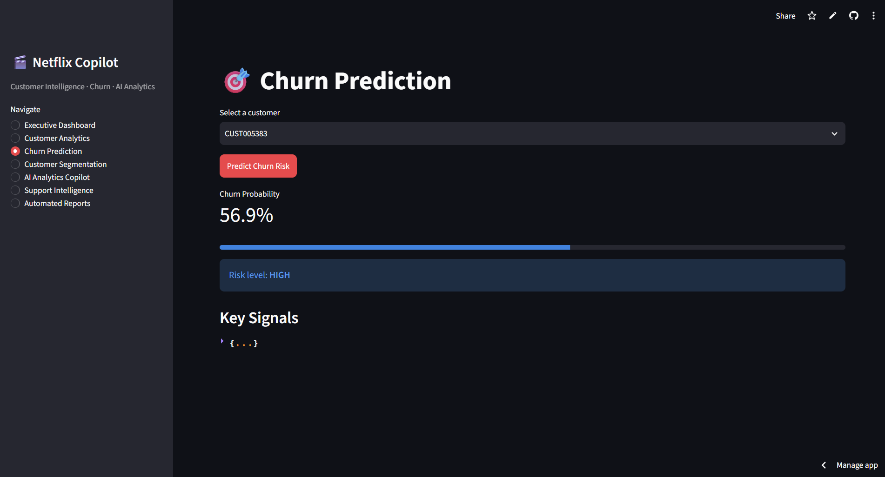
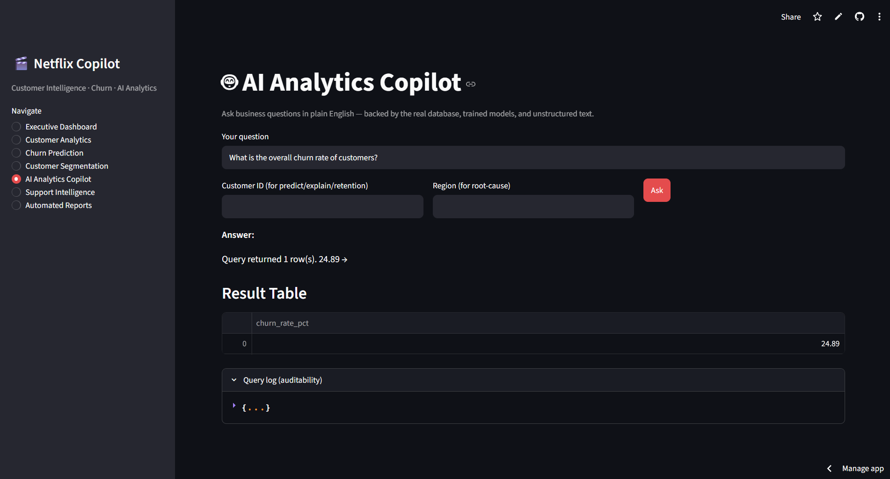

# Netflix Customer Intelligence, Churn Prediction & AI Analytics Copilot

An end-to-end customer intelligence platform that combines **PostgreSQL analytics, machine learning, customer segmentation, churn prediction, CLV modeling, and an AI Analytics Copilot** into one interactive Streamlit application.

Built to answer a practical business question:

> **Which customers are at risk, why are they at risk, and what can the business do about it?**

## 🚀 Live Demo

**[Open the live Streamlit application](https://netflix-customer-intelligence-ai-analytics-copilot.streamlit.app/)**

> The demo uses a cloud PostgreSQL database and deployed application environment.

## 📊 What the Platform Does

### Executive Dashboard
Provides a high-level view of customer and business performance:
- Total customers
- Active subscribers
- Churn rate
- Monthly revenue
- Average support CSAT
- Revenue by subscription plan
- Monthly cancellations

### Customer Analytics
Explores customer behavior across demographics, plans, devices, acquisition channels, and content consumption.

### Churn Prediction
Predicts individual customer churn probability using machine-learning features and classifies customers into risk levels.

### Customer Segmentation
Groups customers into behavior-based segments using unsupervised learning to support targeted marketing and retention strategies.

### AI Analytics Copilot
Allows business users to ask questions in natural language and retrieve answers from the underlying database and analytics layer, with query logging for auditability.

### Support Intelligence
Uses customer support and feedback data to surface service-related insights.

### Automated Reports
Generates automated business reporting from the analytics platform.

## 🧠 Machine Learning

Three core ML capabilities are included:

| Use Case | Best Model | Result |
|---|---|---:|
| Churn Classification | Logistic Regression | AUC **0.6414** |
| Customer Segmentation | K-Means | 7 segments, silhouette **0.181** |
| CLV Regression | Random Forest | R² **0.998** |

### Churn Dataset
- **8,000 customers**
- **24.89% observed churn rate**
- 30 engineered customer-level features

## Key Results

- **8,000 customers** analyzed across **9 relational datasets**
- **24.89% churn rate** identified
- **37/37 SQL validation tests** passed
- **Logistic Regression:** 0.6414 ROC-AUC for churn prediction
- **K-Means:** 7 customer segments identified
- **Random Forest:** 0.998 R² for CLV prediction
- Built an interactive **Streamlit analytics platform** with dashboards, ML predictions, segmentation, support intelligence, and an AI Analytics Copilot

## 🗄️ Data & Analytics

The platform processes **9 relational datasets** covering:

- Customers
- Subscription plans
- Subscriptions
- Content
- Viewing activity
- Payments
- Support tickets
- Customer feedback
- Churn labels

The cleaned data is loaded into PostgreSQL and queried by the application.

## 🛠️ Tech Stack

**Languages & Data**
- Python
- SQL
- Pandas
- NumPy

**Database**
- PostgreSQL

**Machine Learning**
- Scikit-learn
- XGBoost
- Logistic Regression
- Random Forest
- Gradient Boosting
- K-Means

**Application & Analytics**
- Streamlit
- Plotly
- Jupyter Notebook

**Deployment**
- Streamlit Community Cloud
- Supabase PostgreSQL

## 🏗️ Project Architecture

```text
Raw CSV Data
     ↓
Data Cleaning & Validation
     ↓
Feature Engineering
     ↓
PostgreSQL Database
     ↓
 ┌───────────────┬──────────────────┬──────────────────┐
 │ SQL Analytics │ Machine Learning │ AI Analytics     │
 │               │                  │ Copilot          │
 └───────────────┴──────────────────┴──────────────────┘
                       ↓
              Streamlit Application
                       ↓
        Business Dashboards & Insights
```

## 📸 Application Screenshots

### Executive Dashboard


### Churn Prediction


### AI Analytics Copilot


## 📁 Project Structure

```text
├── app/
│   ├── app.py
│   ├── db.py
├── data/
│   ├── raw/
│   └── processed/
├── database/
│   ├── schema.sql
│   └── load_data.py
├── models/
├── notebooks/
├── reports/
├── src/
│   ├── data_processing/
│   ├── features/
│   ├── models/
│   └── llm/
├── tests/
├── requirements.txt
└── README.md
```

## ▶️ Run Locally

### 1. Clone the repository

```bash
git clone https://github.com/TalhaPatel675/Netflix-Customer-Intelligence-AI-Analytics-Copilot.git
cd Netflix-Customer-Intelligence-AI-Analytics-Copilot
```

### 2. Create a virtual environment

```bash
python -m venv venv
```

Activate it on Windows:

```bash
venv\Scripts\activate
```

### 3. Install dependencies

```bash
pip install -r requirements.txt
```

### 4. Configure PostgreSQL

Create a PostgreSQL database and configure the database credentials required by the application.

### 5. Prepare the data

```bash
python src/data_processing/clean.py
python database/load_data.py
python src/features/build_features.py
python src/models/train_models.py
```

### 6. Run the application

```bash
streamlit run app/app.py
```

## 🧪 Validation

The project includes automated SQL validation covering the core analytics queries.

**SQL tests: 37/37 passed**

## 💡 Business Value

This project demonstrates how raw customer data can be transformed into an end-to-end decision-support system:

**Data → SQL Analytics → ML Predictions → Customer Segmentation → AI-Assisted Insights → Business Action**

Potential business applications include:
- Proactive churn prevention
- Customer retention campaigns
- High-value customer identification
- Subscription and revenue analysis
- Support quality monitoring
- Customer lifetime value optimization

## 👨‍💻 Author

**Talha Patel**

GitHub: **[TalhaPatel675](https://github.com/TalhaPatel675)**

---

⭐ If you find this project useful, consider giving the repository a star.
